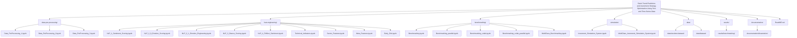

```mermaid
---
id: a0beb514-5b1a-4619-bb29-49643daa3dd3
---
graph TD
    root[Stock-Trend-Prediction-and-Investment-Strategy-Optimisation-Using-Text-and-Time-Series-Data]

    root --> data_pre[data-pre-processing/]
    root --> feat[feat-engineering/]
    root --> bench[benchmarking/]
    root --> sim[simulation/]
    root --> data[data/]
    root --> results[results/]
    root --> docs[documentation/]
    root --> readme[ReadME.md]

    data_pre --> dp1[Data_PreProcessing_1.ipynb]
    data_pre --> dp2[Data_PreProcessing_2.ipynb]
    data_pre --> dp3[Data_PreProcessing_3.ipynb]

    feat --> nlp1[NLP_1_Sentiment_Scoring.ipynb]
    feat --> nlp2[NLP_2_0_Emotion_Scoring.ipynb]
    feat --> nlp2b[NLP_2_1_Emotion_Engineering.ipynb]
    feat --> nlp3[NLP_3_Stance_Scoring.ipynb]
    feat --> nlp4[NLP_4_FinBert_Sentiment.ipynb]
    feat --> ta[Technical_Indicators.ipynb]
    feat --> sector[Sector_Features.ipynb]
    feat --> meta[Meta_Features.ipynb]
    feat --> early[Early_Exit.ipynb]

    bench --> b1[Benchmarking.ipynb]
    bench --> b2[Benchmarking_parallel.ipynb]
    bench --> b3[Benchmarking_colab.ipynb]
    bench --> b4[Benchmarking_colab_parallel.ipynb]
    bench --> b5[MultiClass_Benchmarking.ipynb]

    sim --> s1[Invesment_Simulation_System.ipynb]
    sim --> s2[MultiClass_Invesment_Simulation_System.ipynb]

    data --> stocknet[data/stocknet-dataset/]
    data --> dataset[data/dataset/]

    results --> bench_out[results/benchmarking/]

    docs --> diss[documentation/dissertation/]
```
