# System Architecture

Below is the end‑to‑end workflow for both **multiclass** and **binary/regression** tracks. The pipeline starts from raw price and raw tweet data, and proceeds through cleaning, joining, feature engineering, hyperparameter tuning, meta‑features, second tuning, and investment simulation.

```mermaid
---
id: 02318f88-ee84-4c63-b4a8-b9bcc67a15fb
---
flowchart LR
  %% ----------------------
  %% Data preparation
  %% ----------------------
  subgraph DP[Data Preparation]
    direction TB
    A["Raw Prices<br/>data/stocknet-dataset/price/raw"] --> B["Clean & Tidy Prices<br/>Data_PreProcessing_1.ipynb"]
    C["Raw Tweets<br/>data/stocknet-dataset/tweet/preprocessed"] --> D["Clean Tweets<br/>Data_PreProcessing_1.ipynb"]
    B --> P["stock_prices.parquet"]
    D --> T["stock_tweets.parquet"]
    T --> Tm["merged_stock_tweet.parquet<br/>(optional aggregate)"]
    T --> Tn["stock_tweet_nomerge.parquet<br/>(per-tweet)"]
  end

  %% ----------------------
  %% Join & feature engineering
  %% ----------------------
  subgraph FE[Join + Feature Engineering]
    direction TB
    P --> J1["Join / Align on ticker + date"]
    Tn --> J1
    J1 --> M["stock_tweets.parquet"]
    M --> F1["Feature Engineering<br/>(Technical + NLP + Sector)"]
  end

  %% ----------------------
  %% Base models
  %% ----------------------
  subgraph BM["Base Models"]
    direction TB
    F1 --> B1["Base Models (Binary / Regression)"]
    F1 --> B2["Base Models (Multiclass)"]
  end

  %% ----------------------
  %% Shared benchmarking + HPO
  %% ----------------------
  subgraph BH["Benchmarking + Hyperparameter Tuning (Shared)"]
    direction TB
    BH_IN((in))
    H["Benchmarking + Hyperparameter Tuning"]
    BH_OUT((out))
    BH_IN --> H --> BH_OUT
  end

  %% ----------------------
  %% Meta features
  %% ----------------------
  subgraph MF["Meta Features"]
    direction LR
    MF_IN((in))
    M1["Meta Features<br/>Meta_Features.ipynb"]
    ME["Early Exit"]
    MF_OUT((out))
    MF_IN --> M1
    MF_IN --> ME
    M1 --> MF_OUT
    ME --> MF_OUT
  end

  %% ----------------------
  %% Simulation + outputs
  %% ----------------------
  subgraph SIM[Investment Simulation]
    direction TB
    SIM_IN((in))
    S1["Investment Simulation<br/>Invesment_Simulation_System.ipynb"]
    S2["Investment Simulation (Multiclass)"]
  end

  B1 --> BH_IN
  B2 --> BH_IN
  BH_OUT --> MF_IN
  MF_OUT --> SIM_IN
  SIM_IN --> S1
  SIM_IN --> S2
  M1 -. iterate .-> BH_IN

  H --> O
  S1 --> O["Results & Reports<br/>results/*"]
  S2 --> O
```

## Notes
- **Two inputs**: raw prices and raw tweets are cleaned separately before being joined into a unified modeling dataset (`master_df.parquet`).
- **Tweet handling**: merged (daily per ticker) is optional; the per‑tweet dataset is the default for NLP scoring.
- **Two tracks**: binary/regression and multiclass follow the same stages: feature engineering → base tuning → meta features → meta tuning → simulation.
- **Simulation** consumes the latest tuned models/meta features to generate portfolio decisions and evaluate performance.
